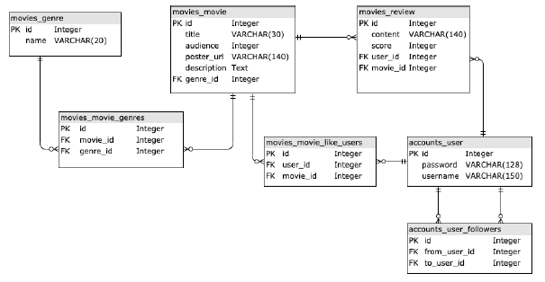
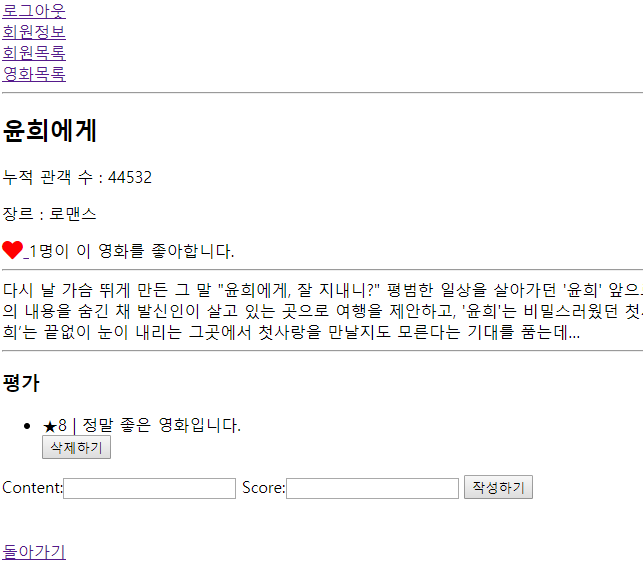

# Github Flow

```bash
$ git config --global user.name tesschung
$ git config --global user.email geobera0910@naver.com
```


## 1. repository init

- master
  1. repo를 생성하여 추가한다.

   ```bash
   $ git init
   $ git remote add origin `주소`
   $ git remote add origin https://github.com/tesschung/github-flow.git
   $ git remote -v
   origin  https://github.com/tesschung/github-flow.git (fetch)
   origin  https://github.com/tesschung/github-flow.git (push)
   
   $ git add .
   $ git commit -m "Initial Commit"
   $ git push origin master
   ```

  5. collabs가 보낸 pull request를 확인한다.
      commit 내역을 확인한다.
      comment 를 남길 수 있다.

  
  6. merge pull request -> confirm merge 클릭
  
  

- collabs
  2. fork로 복사본을 가져온다.

  3. fork한 주소를 git clone한다.

  ```bash
  fork한 repository를 복사해서 $ git clone `주소`
  $ git add .
  $ git commit -m "work"
  $ git push origin master # collabs의 repository에 push된다.
  ```

  4. master한테 작성한 코드를 알린다.
      pull request탭에 들어가서
      new pull request 클릭 하여 push한 코드를 확인하여 자동 merge 요청을 보낸다.


## 2.수정 작업하기

- master
  1. 수정된 내용을 pull 받아서 작업한다.
  2. 작업한 내용을 add commit push 한다.

- collabs 

  3. master repo의 주소를 다시 복사 후 remote를 다시 등록한다.
  ```bash
  $ git remote add upstream `주소`
  ```
  4. 해당 파일을 local repo에 받는다.

  ```bash
  $ git pull upstream master
  ```


# **Project_10** : Django Pair Programming

<p align="center">
  
  
  
</p>


**Entity Relationship Diagram**



**pjt10** project는 `accounts`와 `movies`로 구성되어있습니다.

> accounts


- 유저 회원가입, 로그인, 로그아웃
- 유저 목록
- 유저 상세정보
  - 작성평점정보
  - 좋아요한 영화 정보
  - 유저를 팔로우 한 사람의 수, 팔로잉한 사람의 수

> movies



- 영화 목록
- 영화 상세보기
- 평점 생성
- 평점 삭제
- 영화 좋아요 기능


